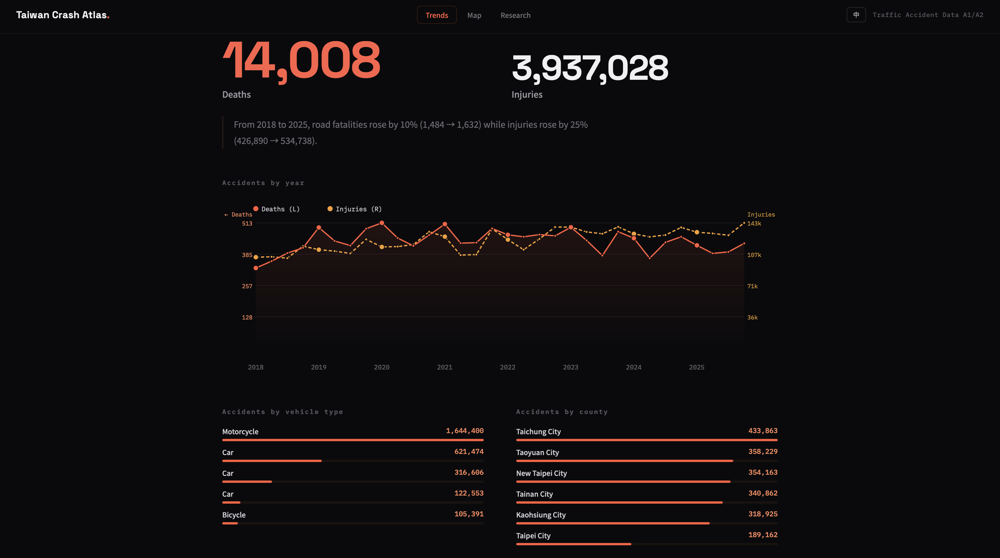
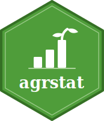

以資料為核心的工具，讓臺灣公開資料更易於探索：互動式視覺化，以及處理政府開放資料的 R 套件。

## 臺灣車禍地圖

::: atlas-figure

:::

::: atlas-figure

:::

將臺灣每一筆車禍紀錄繪成互動地圖，每起事故是一點光。資料取自警政署 A1／A2 事故開放資料，可探索、播放與篩選。

::: atlas-features
- **全臺上圖。** 數十萬筆 A1（死亡）與 A2（受傷）事故逐筆呈現。
- **每日時間軸。** 逐日播放整年事故，同步累計死傷人數。
- **多重篩選。** 年份、縣市、嚴重程度與當事方類別（機車、汽車、卡車、行人）。
- **點選詳情。** 時間、地點、天候、肇因，以及當事人車種、性別與年齡。
- **重點統計。** 高發時段、天候、地點類型、熱點道路與主要肇因。
- **中英雙語介面。**
:::

::: atlas-links
[開啟互動地圖](https://yyliou.github.io/accweb/){.paper-btn target="_blank"}
:::

::: {.atlas-source}
資料來源：警政署道路交通事故 A1／A2 開放資料。
:::

## R 套件

臺灣公部門的開放資料相當豐富，卻往往不夠整潔：各機關的檔案格式、編碼與發布方式互不一致，手動下載與清理既繁瑣又容易出錯。以下這些 R 套件正是為了消除這道麻煩而寫——每一個都將特定公開資料集的取得與清理流程自動化，讓資料能快速、可重複地讀入分析環境。

:::::::: paper-entry
::: hex-col
{fig-alt="agrstat package hex logo"}
:::

::: paper-title
**agrstat**
:::

::: paper-meta
R 套件，115 年
:::

::: paper-desc
可取得農業部「農業統計資料查詢」動態查詢系統之資料。套件重現該網站具狀態的 ASP.NET 查詢流程，將統計分類、資料集、分層（複分類）與時間範圍全部以參數控制；只需 `agri_fetch()` 一次呼叫即可走完整個查詢精靈，並將結果表回傳為整潔的資料框，預設涵蓋該資料集全部的分層與年份。
:::

::: paper-links
[GitHub](https://github.com/yyliou/agri){.paper-btn}
:::
::::::::

:::::::: paper-entry
::: hex-col
{fig-alt="twweather package hex logo"}
:::

::: paper-title
**twweather**
:::

::: paper-meta
R 套件，115 年
:::

::: paper-desc
可下載臺灣中央氣象署（CWA / CODiS）測站歷史氣象觀測資料：整潔格式的測站基本資料、測站層級時間序列（每小時、每日、每月），以及以反距離加權（IDW）空間內插推估的鄉鎮或任意多邊形層級氣象值。
:::

::: paper-links
[GitHub](https://github.com/yyliou/weather){.paper-btn}
:::
::::::::

:::::::: paper-entry
::: hex-col
{fig-alt="twhotel package hex logo"}
:::

::: paper-title
**twhotel**
:::

::: paper-meta
R 套件，115 年
:::

::: paper-desc
以交通部觀光署每月「觀光旅館營運統計」建立旅館月別追蹤資料（panel）。自動爬取、下載並解析官方報表，彙整為單一整潔資料，涵蓋住用率、營收、員工人數與各國籍旅客人數，可直接用於實證分析。
:::

::: paper-links
[GitHub](https://github.com/yyliou/hotel){.paper-btn}
:::
::::::::

:::::::: paper-entry
::: hex-col
{fig-alt="plvr package hex logo"}
:::

::: paper-title
**plvr**
:::

::: paper-meta
R 套件，115 年
:::

::: paper-desc
可下載內政部以開放資料形式發布之臺灣不動產實價登錄交易紀錄。給定日期區間後，逐季下載涵蓋的資料，僅保留所需交易類別（買賣、預售屋、租賃）與行政區，並以精簡的 Parquet 格式儲存，便於以 `arrow`、`dplyr` 或 DuckDB 高效查詢。
:::

::: paper-links
[GitHub](https://github.com/yyliou/re){.paper-btn}
:::
::::::::

:::::::: paper-entry
::: hex-col
{fig-alt="twcovid package hex logo"}
:::

::: paper-title
**twcovid**
:::

::: paper-meta
R 套件，115 年
:::

::: paper-desc
可取得衛福部疾管署 COVID-19 開放資料（確定病例數與死亡病例數），並整理為可直接分析的追蹤資料。透過 `tw_covid()` 一次呼叫即可指定結果類型、時間單位（日、ISO 週、月）、日期基準（發病日或個案研判日）與橫斷面（縣市、鄉鎮、性別、是否境外移入、年齡層任意組合），輸出各期增量或累計值，並可補零為平衡追蹤資料。套件於內部彙整每日原始檔，使時間軸完全可控且可重現。
:::

::: paper-links
[GitHub](https://github.com/yyliou/covid){.paper-btn}
:::
::::::::

:::::::: paper-entry
::: hex-col
{fig-alt="scen package hex logo"}
:::

::: paper-title
**scen**
:::

::: paper-meta
R 套件，115 年
:::

::: paper-desc
可取得交通部觀光署「觀光統計資料庫」資料。該網站無公開 API，`scen` 重現其請求簽章機制，直接在 R 回傳整潔的 `tibble`。可下載主要觀光遊憩據點遊客人數，以及來臺、出國與郵輪旅客資料，並細分至最細交叉統計（如年齡 × 性別 × 目的），同時自動處理民國年轉換、請求節流與快取。
:::

::: paper-links
[GitHub](https://github.com/yyliou/scen){.paper-btn}
:::
: