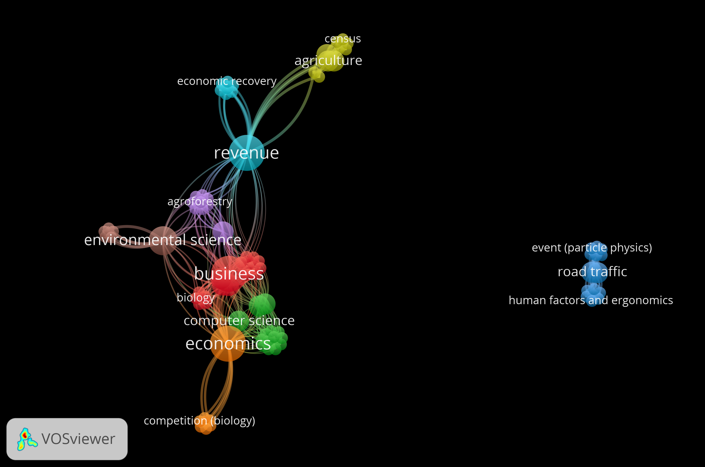

我的研究探討公共政策如何影響環境品質、健康與安全。我主要使用涵蓋母體的行政與普查資料，據以評估政府介入的實際效果。

我的研究涵蓋環境與資源經濟學中三個相互連結的領域。第一是農家經濟與環境資源管理，包括農地上的能源轉型、農業投入使用，以及自然資本的價值。第二是交通運輸的環境與健康外部性，包括碳排放、空氣污染與交通安全。第三是企業與家庭如何因應重大政策變革與外部衝擊，從碳邊境管制到COVID-19 疫情。

在這些領域中，我探討政策應如何處理市場未能定價的外部成本與效益。我期望產出可信的實證證據，改善政策設計，並協助政府更有效率、更公平地配置有限的公共資源。

```{=html}
<script>
// Mobile: shrink PlumX widgets to "small" before the PlumX script initialises
(function () {
  function setSize() {
    if (window.matchMedia('(max-width: 600px)').matches) {
      document.querySelectorAll('a.plumx-plum-print-popup').forEach(function (a) {
        a.setAttribute('data-size', 'medium');
      });
    }
  }
  if (document.readyState === 'loading') {
    document.addEventListener('DOMContentLoaded', setSize);
  } else { setSize(); }
})();
</script>
<script type="text/javascript" src="https://cdn.plu.mx/widget-popup.js"></script>
```

```{=html}
<div class="bib-stats">
  <div class="bib-stat">
    <div class="bib-label">著作數</div>
    <div class="bib-number" data-target="13">0</div>
  </div>
  <div class="bib-stat">
    <div class="bib-label">被引次數</div>
    <div class="bib-number" data-target="88">0</div>
  </div>
  <div class="bib-stat">
    <div class="bib-label">H 指數</div>
    <div class="bib-number" data-target="2">0</div>
  </div>
</div>

<script>
document.addEventListener('DOMContentLoaded', function () {
  const counters = document.querySelectorAll('.bib-number');
  const duration = 1000;
  counters.forEach(function (el) {
    const target = parseInt(el.getAttribute('data-target'), 10);
    const start = performance.now();
    function step(now) {
      const elapsed = now - start;
      const progress = Math.min(elapsed / duration, 1);
      const eased = 1 - Math.pow(1 - progress, 3);
      el.textContent = Math.round(eased * target);
      if (progress < 1) requestAnimationFrame(step);
    }
    requestAnimationFrame(step);
  });
});
</script>

<div class="cite-chart">
  <div class="cite-chart-title">歷年被引次數</div>
  <div class="cite-bars">
    <div class="cite-bar-col"><div class="cite-bar-track"><div class="cite-bar" data-h="35"><span class="cite-bar-val" data-val="7">0</span></div></div><span class="cite-bar-year">2021</span></div>
    <div class="cite-bar-col"><div class="cite-bar-track"><div class="cite-bar" data-h="75"><span class="cite-bar-val" data-val="15">0</span></div></div><span class="cite-bar-year">2022</span></div>
    <div class="cite-bar-col"><div class="cite-bar-track"><div class="cite-bar" data-h="100"><span class="cite-bar-val" data-val="20">0</span></div></div><span class="cite-bar-year">2023</span></div>
    <div class="cite-bar-col"><div class="cite-bar-track"><div class="cite-bar" data-h="95"><span class="cite-bar-val" data-val="19">0</span></div></div><span class="cite-bar-year">2024</span></div>
    <div class="cite-bar-col"><div class="cite-bar-track"><div class="cite-bar" data-h="80"><span class="cite-bar-val" data-val="16">0</span></div></div><span class="cite-bar-year">2025</span></div>
    <div class="cite-bar-col"><div class="cite-bar-track"><div class="cite-bar" data-h="45"><span class="cite-bar-val" data-val="9">0</span></div></div><span class="cite-bar-year">2026</span></div>
  </div>
</div>

<script>
document.addEventListener('DOMContentLoaded', function () {
  var chart = document.querySelector('.cite-chart');
  if (!chart) return;
  var duration = 1100;

  function animate() {
    chart.querySelectorAll('.cite-bar').forEach(function (bar) {
      bar.style.height = (parseFloat(bar.getAttribute('data-h')) || 0) + '%';
    });
    chart.querySelectorAll('.cite-bar-val').forEach(function (el) {
      var target = parseInt(el.getAttribute('data-val'), 10) || 0;
      var start = performance.now();
      function step(now) {
        var p = Math.min((now - start) / duration, 1);
        var eased = 1 - Math.pow(1 - p, 3);
        el.textContent = Math.round(eased * target);
        if (p < 1) requestAnimationFrame(step);
      }
      requestAnimationFrame(step);
    });
  }

  if ('IntersectionObserver' in window) {
    var io = new IntersectionObserver(function (entries, obs) {
      entries.forEach(function (e) {
        if (e.isIntersecting) { animate(); obs.disconnect(); }
      });
    }, { threshold: 0.3 });
    io.observe(chart);
  } else {
    animate();
  }
});
</script>
```

::: paper-note
*附註*：有兩筆文獻無法對應至相應年份，因此未納入圖中。
:::

我的研究成果主要發表於區域研究與農業經濟學領域之國際期刊，包括知名的Journal of Transport Geography、Transportation Research Part A及Part D、Food Policy以及Forest Policy and Economics。詳細研究成果請參閱[研究自述](https://yyliou.github.io/yyliou/rs/rs_zh.pdf)。

::: fig-light
{fig-alt="研究主題網絡圖，涵蓋經濟學、環境科學、農業、收益與COVID-19等主題"}
:::

::: fig-dark
{fig-alt="研究主題網絡圖，涵蓋經濟學、環境科學、農業、收益與COVID-19等主題"}
:::

## **焦點著作**

::::::: paper-entry
::: paper-tag
Food Policy
:::

::: paper-title
11\. Food Traceability Systems and the Probability of Using Chemical Fertilizers and Pesticides: Empirical Evidence Using Plot- and Farm Household-Level Data
:::

::: paper-meta
***Food Policy***, forthcoming, 2026 (with Chang). ⁺‡
:::

::: paper-links
[摘要]{.paper-btn .abs-toggle} [BibTeX]{.paper-btn .bib-toggle} [SSCI]{.idx-badge}
:::

```{=html}
<div class="abstract-box"><p>In response to rising consumer demand for food safety, many countries have implemented food traceability systems (FTS) to enhance transparency and accountability along agricultural supply chains. While existing research has largely focused on demand side aspects, evidence on supply side responses remains limited. This study addresses this gap by examining the effects of FTS adoption on farm production practices, specifically the probability of using chemical fertilizers, pesticides, and groundwater, as well as farm revenue and marketing channel selection. We use microdata from Taiwan's 2020 agriculture census, which provides both plot-level and farm household-level information covering all registered crop farms. Motivated by a farm profit maximization model, we employ an instrumental variable (IV) approach to identify the local average treatment effect of FTS adoption. At the plot level, FTS adoption reduces the probability of using chemical fertilizer, pesticide, and groundwater by 8.2, 15.4, and 40 percentage points, respectively. At the household level, FTS adoption increases farm revenues and expands sales through direct-to-consumer and distributor channels. These findings suggest that while FTS is primarily designed to ensure food safety and market transparency, its adoption may generate unintended environmental co-benefits through reducing the likelihood of using environmentally sensitive inputs in farm production.</p></div>
<div class="bibtex-box"><pre><code>@article{chang2026traceability,
  title   = {Food Traceability Systems and the Probability of Using Chemical Fertilizers and Pesticides: Empirical Evidence Using Plot- and Farm Household-Level Data},
  author  = {Chang, Hung-Hao and Liou, Yu-You},
  journal = {Food Policy},
  note    = {Forthcoming},
  year    = {2026},
}</code></pre></div>
```
:::::::

::::::: paper-entry
::: paper-tag
Transp. Res. A

```{=html}
<a href="https://plu.mx/plum/a/?doi=10.1016%2Fj.tra.2026.104860" class="plumx-plum-print-popup" data-popup="right" data-size="large" data-site="plum" data-hide-when-empty="false"></a>
```
:::

::: paper-title
10\. The causal effects of removing hook-turn regulation on road safety
:::

::: paper-meta
***Transportation Research Part A: Policy and Practice***, 205, 104860, 2026 (with Chang). †\*\^⁺‡

[Earlier version presented at the 20th EAEA International Convention (2025).]{.paper-earlier}
:::

::: paper-links
[期刊全文](https://doi.org/10.1016/j.tra.2026.104860){.paper-btn} [摘要]{.paper-btn .abs-toggle} [BibTeX]{.paper-btn .bib-toggle} [媒體報導]{.paper-btn .media-toggle} [SSCI]{.idx-badge} [SCIE]{.idx-badge}
:::

```{=html}
<div class="abstract-box"><p>Traffic safety and related policy interventions have garnered increasing attention from both scholars and policymakers. While prior research has primarily focused on the role of infrastructure improvements in mitigating traffic accident risks, relatively little attention has been given to the impact of hook-turn (HT) traffic regulations. HT is a specialized traffic regulation implemented at intersections, requiring vehicles to proceed to the far side of the cross street and wait for the green light in the intersecting direction before completing their turn. This regulation has been adopted in countries or regions such as Japan, Australia, and Taiwan. This paper empirically examines the causal effects of HT regulation on traffic accidents by exploiting a policy reform in Tainan City, Taiwan, where HT was removed in some townships. Using this policy change as a quasi-natural experiment, we apply a difference-in-discontinuity design to estimate its impact on traffic accident outcomes, including the number of accidents, the number of victims, and the number of vehicles involved. Our findings indicate that the policy reform led to a 21% reduction in accident cases and a 19% decrease in the number of victims. The reduction is primarily driven by injury-related rather than fatal incidents. Additionally, the total number of vehicles involved in accidents declined by 28%, with larger reductions observed for motorcycles (–26%) than for automobiles (–18%). A back-of-the-envelope calculation suggests that the policy resulted in a 4.7% decrease in total medical expenditures among residents in the treated areas during the study period.</p></div>
<div class="bibtex-box"><pre><code>@article{liou2026hookturn,
  title   = {The causal effects of removing hook-turn regulation on road safety},
  author  = {Liou, Yu-You and Chang, Hung-Hao},
  journal = {Transportation Research Part A: Policy and Practice},
  volume  = {205},
  pages   = {104860},
  year    = {2026},
  doi     = {10.1016/j.tra.2026.104860},
}</code></pre></div>
<div class="abstract-box media-box"><ul>
<li><a href="https://www.ntu.edu.tw/spotlight/2026/2482_20260429.html" target="_blank" rel="noopener">國立臺灣大學焦點新聞：制度改革如何改善交通安全？臺大研究成果登上國際交通運輸領域傑出期刊</a></li>
<li><a href="https://news.ltn.com.tw/news/life/breakingnews/5422721" target="_blank" rel="noopener">自由時報：取消機車兩段式左轉降風險？台大實證研究：特定情境下更安全</a></li>
<li><a href="https://www.ettoday.net/news/20260502/3158984.htm" target="_blank" rel="noopener">ETtoday：「取消兩段式左轉」事故減21%！台大實證更安全 醫療支出降4.7%</a></li>
<li><a href="https://www.chinatimes.com/newspapers/20260412000322-260121" target="_blank" rel="noopener">中國時報：機車兩段式左轉取消 事故降21%</a></li>
</ul></div>
```
:::::::

::::::: paper-entry
::: paper-tag
Transp. Res. D

```{=html}
<a href="https://plu.mx/plum/a/?doi=10.1016%2Fj.trd.2025.104903" class="plumx-plum-print-popup" data-popup="right" data-size="large" data-site="plum" data-hide-when-empty="false"></a>
```
:::

::: paper-title
9\. The causal effect of monthly pass programs on public transportation and carbon emissions
:::

::: paper-meta
***Transportation Research Part D: Transport and Environment***, 146, 104903, 2025 (with Kim, Chang, and Liou). †\^⁺‡
:::

::: paper-links
[期刊全文](http://doi.org/10.1016/j.trd.2025.104903){.paper-btn} [摘要]{.paper-btn .abs-toggle} [BibTeX]{.paper-btn .bib-toggle} [SSCI]{.idx-badge} [SCIE]{.idx-badge}
:::

```{=html}
<div class="abstract-box"><p>While existing research has examined the relationship between monthly pass and public transportation usage, limited attention has been given to their effects on carbon emissions. This paper evaluates the impact of a monthly pass program in the Taipei Metro system on travel behavior. Using administrative origin–destination records and a difference-in-differences method, we find that the program increased metro ridership, passenger kilometers, and trip value by 4.3%, 4.6%, and 4.6%, respectively. The effects are more pronounced for trips occurring on weekends, during peak hours, and at stations located near schools, residential areas, and business districts. Moreover, a larger effect of the program is found at higher ticket prices. Estimates of a back-of-the-envelope calculation suggest that the program delivers negative overall carbon emissions as long as at least 70–80% of the increased metro usage was shifted from trips previously made by private cars or motorcycles.</p></div>
<div class="bibtex-box"><pre><code>@article{liou2025monthlypass,
  title   = {The causal effect of monthly pass programs on public transportation and carbon emissions},
  author  = {Liou, Yu-You and Kim, Man-Keun and Chang, Hung-Hao and Liou, Ruey-Wan},
  journal = {Transportation Research Part D: Transport and Environment},
  volume  = {146},
  pages   = {104903},
  year    = {2025},
  doi     = {10.1016/j.trd.2025.104903},
}</code></pre></div>
```
:::::::

::::::: paper-entry
::: paper-tag
Forest Policy Econ.

```{=html}
<a href="https://plu.mx/plum/a/?doi=10.1016%2Fj.forpol.2024.103411" class="plumx-plum-print-popup" data-popup="right" data-size="large" data-site="plum" data-hide-when-empty="false"></a>
```
:::

::: paper-title
8\. Forest diversity and the distribution of farm revenue — Empirical evidence from forest farms in Taiwan
:::

::: paper-meta
***Forest Policy and Economics***, 171, 103411, 2025 (with Lee and Chang). ⁺‡
:::

::: paper-links
[期刊全文](http://doi.org/10.1016/j.forpol.2024.103411){.paper-btn} [摘要]{.paper-btn .abs-toggle} [BibTeX]{.paper-btn .bib-toggle} [SSCI]{.idx-badge} [SCIE]{.idx-badge}
:::

```{=html}
<div class="abstract-box"><p>Forest diversity is important for the increase in biodiversity since higher levels of multiple ecosystem services are found in forests with a greater variety of tree species. Although a sizable body of literature has focused on the biodiversity of forest farms, little is known about the relationship between forest diversity and the economic performance of forest farms. This paper contributes to this research topic by investigating the relationship between forest diversity and forest revenue using a population-based dataset of all registered forest farms in Taiwan. In contrast to previous studies, we pay attention not only to the mean returns but also the variability in forest farm revenue. We apply the instrumental variable method with the average elevation of a farm's township as the instrument to correct for endogeneity bias. We find that forest diversity reduces the mean level and the associated dispersion of farm revenue. Moreover, the magnitude of the effect is more pronounced for the latter. By further looking at labor use on the forest farm, we find that farms that plant a greater variety of tree species require more male labor.</p></div>
<div class="bibtex-box"><pre><code>@article{lee2025forest,
  title   = {Forest diversity and the distribution of farm revenue---Empirical evidence from forest farms in Taiwan},
  author  = {Lee, Tzong-Haw and Liou, Yu-You and Chang, Hung-Hao},
  journal = {Forest Policy and Economics},
  volume  = {171},
  pages   = {103411},
  year    = {2025},
  doi     = {10.1016/j.forpol.2024.103411},
}</code></pre></div>
```
:::::::

::::::: paper-entry
::: paper-tag
J. Transp. Geogr.

```{=html}
<a href="https://plu.mx/plum/a/?doi=10.1016%2Fj.jtrangeo.2021.102954" class="plumx-plum-print-popup" data-popup="right" data-size="large" data-site="plum" data-hide-when-empty="false"></a>
```
:::

::: paper-title
7\. Does COVID-19 affect metro use in Taipei?
:::

::: paper-meta
***Journal of Transport Geography***, 91, 102954, 2021 (with Chang, Lee, and Yang). †\^⁺‡
:::

::: paper-links
[期刊全文](http://doi.org/10.1016/j.jtrangeo.2021.102954){.paper-btn} [摘要]{.paper-btn .abs-toggle} [BibTeX]{.paper-btn .bib-toggle} [SSCI]{.idx-badge}
:::

```{=html}
<div class="abstract-box"><p>This paper provides the first evidence of the causal effect of COVID-19 on metro use using real-time data from the Taipei Metro System in Taiwan. In contrast to other cities or countries, Taiwan did not enforce strict social lockdowns or mandatory stay-at-home orders to combat COVID-19. The major prevention strategies to the pandemic in Taiwan include promoting social distancing, mandating the wearing of face masks in public areas, and requiring all international arrivals to quarantine for 14 days. Using administrative data on confirmed cases of COVID-19 and ridership from metro stations with the difference-in-differences model, we find that an additional new confirmed case of COVID-19 reduces metro use by 1.43% after controlling for local socio-demographic variables associated with ridership and the number of international arrivals to Taiwan. This result implies that the reduction in metro trips is attributable to decreases in residents' use of public transportation due to perceived health risks. Furthermore, the effect of COVID-19 on metro use disproportionally impacts stations with different characteristics. The effect is more pronounced for metro stations connected to night markets, shopping centers, or colleges. Although decreases in metro ridership lower the revenue of the Taipei Metro System, our results indicate a tradeoff between increased financial burdens of public transportation systems and reducing medical expenses associated with COVID-19.</p></div>
<div class="bibtex-box"><pre><code>@article{chang2021covid,
  title   = {Does COVID-19 affect metro use in Taipei?},
  author  = {Chang, Hung-Hao and Lee, Brian and Yang, Feng-An and Liou, Yu-You},
  journal = {Journal of Transport Geography},
  volume  = {91},
  pages   = {102954},
  year    = {2021},
  doi     = {10.1016/j.jtrangeo.2021.102954},
}</code></pre></div>
```
:::::::

::: paper-note
*附註*：† 科技部區域研究與地理學門推薦期刊；\* 科技部經濟學門推薦期刊。\^ 科技部管理二學門推薦期刊。⁺ 期刊影響因子位於該領域前 10%。‡ 國立臺灣大學傑出期刊；§ 國立臺灣大學優良期刊。
:::

```{=html}
<div class="journal-covers">
<a class="cover-item" href="https://www.sciencedirect.com/journal/food-policy" target="_blank" rel="noopener" title="Food Policy"><span class="cover-name">Food Policy</span></a>
<a class="cover-item" href="https://www.sciencedirect.com/journal/transportation-research-part-a-policy-and-practice" target="_blank" rel="noopener" title="Transportation Research Part A"><span class="cover-name">Transportation Research Part A</span></a>
<a class="cover-item" href="https://www.sciencedirect.com/journal/transportation-research-part-d-transport-and-environment" target="_blank" rel="noopener" title="Transportation Research Part D"><span class="cover-name">Transportation Research Part D</span></a>
<a class="cover-item" href="https://www.sciencedirect.com/journal/forest-policy-and-economics" target="_blank" rel="noopener" title="Forest Policy and Economics"><span class="cover-name">Forest Policy and Economics</span></a>
<a class="cover-item" href="https://www.sciencedirect.com/journal/journal-of-transport-geography" target="_blank" rel="noopener" title="Journal of Transport Geography"><span class="cover-name">Journal of Transport Geography</span></a>
</div>
```

## **其他著作**

::::::: paper-entry
::: paper-tag
J. Tour. Manag. Res.
:::

::: paper-title
6\. Hotel recovery strategies in the post-COVID-19 era: evidence on revenue, employment, and labor market rigidity from Taiwan
:::

::: paper-meta
***Journal of Tourism Management Research***, 13(1), 148–162, 2026 (with Kim and Chang).
:::

::: paper-links
[期刊全文](https://archive.conscientiabeam.com/index.php/31/article/view/4940){.paper-btn} [摘要]{.paper-btn .abs-toggle} [BibTeX]{.paper-btn .bib-toggle} [ESCI]{.idx-badge}
:::

```{=html}
<div class="abstract-box"><p>This study examines the recovery trajectory of the hotel industry in the post-COVID-19 period in Taiwan, with a particular focus on revenue performance, employment dynamics, service quality, and guest demand. It further evaluates the role of labor market rigidity and heterogeneous recovery patterns across hotel types and locations. Using a comprehensive panel dataset covering all tourist hotels in Taiwan from January 2015 to September 2024, this study employs fixed-effects regression models to estimate the impacts of different pandemic phases on hotel performance. The analysis controls for time-invariant hotel characteristics, seasonal variation, and weather conditions, and further incorporates dynamic specifications and simulation analyses to assess recovery mechanisms. The total and room revenues recovered in the post-COVID period were approximately 9% and 13%, respectively. Moreover, this rebound was primarily driven by higher room rates rather than occupancy. In contrast, employment, service quality, and guest visits remained below pre-pandemic levels, indicating persistent labor shortages consistent with labor market rigidity. Heterogeneity analysis reveals that rural and non-five-star hotels experienced faster recovery than urban and luxury hotels. Simulation results suggest that restoring employment to pre-pandemic levels could increase revenues by up to 17.8%, exceeding the gains from demand recovery alone. The findings highlight the critical importance of workforce recovery in the hotel industry. Managers should prioritize employee retention and recruitment alongside demand stimulation strategies, while policymakers may consider labor market interventions to facilitate a more balanced and sustainable recovery.</p></div>
<div class="bibtex-box"><pre><code>@article{liou2026hotel,
  title   = {Hotel recovery strategies in the post-COVID-19 era: Evidence on revenue, employment, and labor market rigidity from Taiwan},
  author  = {Liou, Yu-You and Kim, Man-Keun and Chang, Hung-Hao},
  journal = {Journal of Tourism Management Research},
  volume  = {13},
  number  = {1},
  pages   = {148--162},
  year    = {2026},
}</code></pre></div>
```
:::::::

::::::: paper-entry
::: paper-tag
Ann. Tour. Res.

```{=html}
<a href="https://plu.mx/plum/a/?doi=10.1016%2Fj.annale.2026.100209" class="plumx-plum-print-popup" data-popup="right" data-size="large" data-site="plum" data-hide-when-empty="false"></a>
```
:::

::: paper-title
5\. Traffic accidents of religious tourism
:::

::: paper-meta
***Annals of Tourism Research Empirical Insights***, 7(1), 100209, 2026 (with Chang).

[Earlier version presented at the 19th EAEA International Convention (2024).]{.paper-earlier}
:::

::: paper-links
[期刊全文](https://doi.org/10.1016/j.annale.2026.100209){.paper-btn} [摘要]{.paper-btn .abs-toggle} [BibTeX]{.paper-btn .bib-toggle} [ESCI]{.idx-badge}
:::

```{=html}
<div class="abstract-box"><ul><li>We explore the causal impact of a religious pilgrimage event on traffic accidents.</li><li>We use the Dajia Mazu Pilgrimage (DMP) event of Chinese society as an illustration.</li><li>We apply the difference-in-differences method and use administrative data of vehicle transportation and traffic accidents.</li><li>We find that the increased number of non-fatal injury traffic accidents during the pilgrimage.</li><li>The loss of labor productivity and medical expenses contribute 6.3% to the total traffic accident costs in society.</li></ul></div>
<div class="bibtex-box"><pre><code>@article{liou2026religious,
  title   = {Traffic accidents of religious tourism},
  author  = {Liou, Yu-You and Chang, Hung-Hao},
  journal = {Annals of Tourism Research Empirical Insights},
  volume  = {7},
  number  = {1},
  pages   = {100209},
  year    = {2026},
  doi     = {10.1016/j.annale.2026.100209},
}</code></pre></div>
```
:::::::

::::::: paper-entry
::: paper-tag
Agribusiness

```{=html}
<a href="https://plu.mx/plum/a/?doi=10.1002%2Fagr.70035" class="plumx-plum-print-popup" data-popup="right" data-size="large" data-site="plum" data-hide-when-empty="false"></a>
```
:::

::: paper-title
4\. Rooftop Solar Energy Adoption and Farm Revenue
:::

::: paper-meta
***Agribusiness***, forthcoming, 2025 (with Chang).

[Earlier version presented at the 18th Congress of EAAE (2025) and the 19th EAEA International Convention (2024).]{.paper-earlier}
:::

::: paper-links
[期刊全文](https://onlinelibrary.wiley.com/doi/abs/10.1002/agr.70035){.paper-btn} [摘要]{.paper-btn .abs-toggle} [BibTeX]{.paper-btn .bib-toggle} [SSCI]{.idx-badge} [SCIE]{.idx-badge}
:::

```{=html}
<div class="abstract-box"><p>Solar energy production has grown substantially in agriculture. This paper examines farmers' adoption of rooftop photovoltaic (PV) systems, and how rooftop PV installation is associated with farm revenue, farm business diversification, and labor allocation. We develop a theoretical model to illustrate how farmers decide to adopt rooftop PV systems. The empirical analysis is based on a population‐based sample of livestock and poultry farms drawn from the 2020 agriculture census survey in Taiwan. We address potential endogeneity bias using several treatment effect models based on the selection‐on‐observable approach to identify the relationship between rooftop PV installation and farm revenue. We find that more educated farm operators and farms located in areas with higher density of electrical substations are more likely to adopt PV. Furthermore, PV adopters report higher farm product sales and greater labor use in farm activities. These findings imply that rooftop PV adoption could provide a mutually beneficial opportunity to enhance photovoltaic generation and improve farm revenue.</p></div>
<div class="bibtex-box"><pre><code>@article{liou2025rooftop,
  title   = {Rooftop solar energy adoption and farm revenue},
  author  = {Liou, Yu-You and Chang, Hung-Hao},
  journal = {Agribusiness},
  year    = {2025},
  note    = {Forthcoming},
  doi     = {10.1002/agr.70035},
}</code></pre></div>
```
:::::::

::::::: paper-entry
::: paper-tag
Singapore Econ. Rev.

```{=html}
<a href="https://plu.mx/plum/a/?doi=10.1142%2FS0217590825500328" class="plumx-plum-print-popup" data-popup="right" data-size="large" data-site="plum" data-hide-when-empty="false"></a>
```
:::

::: paper-title
3\. The impact of the carbon border adjustment mechanism policy on international trade and market competition — A theoretical justification
:::

::: paper-meta
***Singapore Economic Review***, forthcoming, 2025 (with Chang and Begun).
:::

::: paper-links
[期刊全文](https://www.worldscientific.com/doi/10.1142/S0217590825500328){.paper-btn} [摘要]{.paper-btn .abs-toggle} [BibTeX]{.paper-btn .bib-toggle} [SSCI]{.idx-badge}
:::

```{=html}
<div class="abstract-box"><p>To address carbon leakage, the European Union (EU) introduced the Carbon Border Adjustment Mechanism (CBAM) to regulate embedded emissions in imports. While prior studies focus on the environmental and trade impacts of CBAM, most of them rely on data simulations and lack theoretical grounding. This paper extends a strategic trade model with green energy investment to examine non-EU countries’ responses under CBAM and non-CBAM scenarios. Findings reveal that CBAM encourages green investment, shifts firm competitiveness and transforms market competition. The study provides theoretical insights into the economic dynamics of CBAM and the global acceleration of green energy development.</p></div>
<div class="bibtex-box"><pre><code>@article{liou2025cbam,
  title   = {The impact of the carbon border adjustment mechanism policy on international trade and market competition---A theoretical justification},
  author  = {Liou, Yu-You and Chang, Hung-Hao and Begun, Jeffrey C.},
  journal = {The Singapore Economic Review},
  year    = {2025},
  note    = {Forthcoming},
  doi     = {10.1142/S0217590825500328},
}</code></pre></div>
```
:::::::

::::::: paper-entry
::: paper-tag
Agriculture

```{=html}
<a href="https://plu.mx/plum/a/?doi=10.3390%2Fagriculture15202124" class="plumx-plum-print-popup" data-popup="right" data-size="large" data-site="plum" data-hide-when-empty="false"></a>
```
:::

::: paper-title
2\. Is Solar Panel Adoption a Win–Win Strategy for Chicken Farms? Evidence from Agriculture Census Data
:::

::: paper-meta
***Agriculture***, 15(20), 2124, 2025 (with Lee and Chang).
:::

::: paper-links
[期刊全文](https://www.mdpi.com/2077-0472/15/20/2124){.paper-btn} [摘要]{.paper-btn .abs-toggle} [BibTeX]{.paper-btn .bib-toggle} [SCIE]{.idx-badge}
:::

```{=html}
<div class="abstract-box"><p>Concerns over ground-mounted photovoltaics (PVs) on cropland have encouraged a shift toward rooftop PV systems on livestock and poultry farms. Using ex-post observational data and a doubly robust estimation approach, this study examines the determinants and economic effects of PV adoption among chicken farmers in Taiwan. Based on a population-wide agricultural census, we assess how socio-demographic factors, production practices, household composition, and electricity infrastructure influence adoption decisions. The results show that education level, household structure, and access to electricity are key drivers of adoption. PV adopters exhibit a 5.8% higher sales value of chicken products, mainly due to increased production volume rather than quality improvements. These findings highlight the potential dual benefits of integrating solar energy with poultry farming and provide policy-relevant insights for sustainable agricultural development.</p></div>
<div class="bibtex-box"><pre><code>@article{lee2025solar,
  title   = {Is Solar Panel Adoption a Win--Win Strategy for Chicken Farms? Evidence from Agriculture Census Data},
  author  = {Lee, Tzong-Haw and Liou, Yu-You and Chang, Hung-Hao},
  journal = {Agriculture},
  volume  = {15},
  number  = {20},
  pages   = {2124},
  year    = {2025},
  doi     = {10.3390/agriculture15202124},
}</code></pre></div>
```
:::::::

::::::: paper-entry
::: paper-tag
Qual. & Quant.

```{=html}
<a href="https://plu.mx/plum/a/?doi=10.1007%2Fs11135-024-01915-9" class="plumx-plum-print-popup" data-popup="right" data-size="large" data-site="plum" data-hide-when-empty="false"></a>
```
:::

::: paper-title
1\. How do consumers respond to COVID-19? Application of Bayesian approach on credit card transaction data
:::

::: paper-meta
***Quality & Quantity***, 58(6), 5737–5754, 2024 (with Chang and Just).
:::

::: paper-links
[期刊全文](https://link.springer.com/article/10.1007/s11135-024-01915-9){.paper-btn} [摘要]{.paper-btn .abs-toggle} [BibTeX]{.paper-btn .bib-toggle}
:::

```{=html}
<div class="abstract-box"><p>Determining how consumers respond to unexpected outbreaks has been one of the core research areas in risk analysis. Using the case of the COVID-19 pandemic, this study estimates consumption behavior and pays significant attention to understanding the information updating process of consumers regarding the spread of the pandemic. We propose four different models of information updating: the naïve expectation, adaptive expectation, perfect and non-perfect Bayesian models. Using the real-time credit card transactions in Taiwan, we find that consumers respond to the spread of COVID-19 confirmed cases in the way predicted by the perfect Bayesian model. Moreover, we find that COVID-19 increases consumers' expenditure on clothing and transportation in offline markets. With respect to food consumption, we find a decrease in offline and an increased expenditure in online markets. Our findings are robust to different measurements of COVID-19 spread.</p></div>
<div class="bibtex-box"><pre><code>@article{liou2024consumers,
  title   = {How do consumers respond to COVID-19? Application of Bayesian approach on credit card transaction data},
  author  = {Liou, Yu-You and Chang, Hung-Hao and Just, David R.},
  journal = {Quality \& Quantity},
  volume  = {58},
  number  = {6},
  pages   = {5737--5754},
  year    = {2024},
  doi     = {10.1007/s11135-024-01915-9},
}</code></pre></div>
```
:::::::

## **進行中研究**

### 修訂中

- Air Pollution during Religious Holidays: Evidence from Tomb-Sweeping Day (with Chang and Meyerhoefer).
- Does the Development of Aquavoltaics Production Affect Farmland Price? (with Chang).
- The Effects of Enhancing Pedestrian-Protective Infrastructure on Intersection Safety (with Chang).
- Do Consumption Vouchers Benefit Agricultural Cooperatives? Causal Evidence from Farmers' Associations (with Chang and Wu).
- Technology Adoption of Environmentally Controlled Housing System and the Distribution of Farm Revenue (with Chang).

### 審稿中

- Air Quality vs. Fiscal Compensation: Evidence from Coal Reduction and Housing Markets (with Chang and Zilberman).
- Green Gentrification beyond the City: The Impacts of Ecosystem Investment on Housing Markets and Agricultural Community Dynamics (with Chang).

### 投稿中

- From Gasoline to Electric: Economic and Environmental Impacts of Taxi Electrification (with Chang).
- Does Adopting a Forest Restoration Program Affect Firms' Financial Performance? A Doubly Robust Machine Learning Approach (with Chang and Sun).
- Pension Policy Reform of the Minimum Contribution Period and Intra-household Succession of Family Farms (with Chang).

### 待投稿

- Does Metro Expansion Always Reduce Traffic Accidents? (with Chang).

## **共同作者**

```{=html}
<div class="coauthor-map">
<svg viewBox="0 0 1000 392" xmlns="http://www.w3.org/2000/svg" role="img">
<path class="cmap-land" d="M282.8 213 279 211.3 276.4 213.6 277.8 215.1 275.3 216.1 274.8 214.4 268 212.6 264 208.1 263.6 209.6 262.1 208.5 261.9 205.3 256.5 200.3 257 199.2 246.6 197.4 237 191.1 231.8 192.6 212.5 185.3 207 180.7 207.6 176.6 205.5 172.9 188.3 155.7 185.7 149.5 181.2 147.8 181.5 152.3 196 171.7 194.4 172.7 188.4 167.4 188.1 163.9 180.4 159.1 182.9 156.8 179.1 154 174.2 144.3 170.8 141.6 164.9 140 154.4 124.1 154.1 117.3 155.8 109.7 153.6 102.3 158 102.7 159.5 105.3 158.8 100 151 96.1 146 94.9 144.9 90.8 141.3 89.6 140.8 87.3 133.4 82 127.6 74.7 120.5 74.4 111.5 70.7 91.3 67 88.3 67.6 88.8 69.5 78.6 71.8 79.4 67.4 82.4 66.6 81.6 65.9 72.2 71.2 74.2 72.6 71.6 74.6 59.9 80.6 42.3 85 61.9 76.2 63.8 72.4 58.2 73.8 54.6 72 50.1 73.1 50.3 70.5 48.6 69.5 44.9 70 40.7 68 38.6 65.3 39.6 63.7 42.9 60.7 53.4 59 51.3 57.2 53.4 56.1 41.8 57.1 33 53.7 43.1 51.2 45.4 51.2 45 52.6 50.9 52.5 36.8 46.2 38.3 44.8 46.8 43.4 50.3 40.7 65.1 37.9 71.3 39.7 101.1 41.2 120.8 44.7 139.5 41.1 141.4 42.3 144.1 40.3 150.7 43.1 154.4 41.2 154.8 43.3 162.6 42.2 183.6 46.1 179.7 47.5 194.6 47.3 197.6 48.9 200.6 47.5 197.7 46.4 199.5 45.4 205.1 45 218.2 48.2 226.5 47.8 226.2 46.1 228.7 45.6 233 46.6 233 49.2 234.8 47 237 47 238.2 44.3 232 41.4 232.2 38.3 235.5 36.3 239.2 36.8 245.8 41.1 243.3 42.5 248.5 43.1 248.5 45.9 252.2 43.7 255.5 45.5 254.7 47.6 257.4 49.4 262.3 45 262.4 42 270.5 42.6 274.2 44 274.4 45.4 272.3 46.9 274.3 48.3 273.9 49.7 268.5 51.6 261.8 51.2 257.4 56.2 248 59.4 247.9 61.2 244.6 61.6 238.2 66.9 237 72.4 241.1 72.8 243.6 77.5 247.5 77 263.9 82.5 271.5 82.9 271.9 88.1 278 93.9 281.7 90.1 278.3 84.3 282.7 83 287.4 79.1 285.3 74.9 281.9 72.8 285.2 69.9 283 63 294.9 62.7 301.7 66.3 306.7 66.5 307.5 72.3 312.1 74.4 316.1 72.9 320.6 68.5 329.5 77.9 328.3 79.6 340.7 84.4 341.8 86.7 345.1 88.1 345.3 91.3 333.2 96.5 315.6 96.6 302.5 106.1 309.3 101.9 319.3 99.4 321.7 100.7 319.1 102.6 320.9 107.7 324.5 109.1 329.1 108.7 331.9 105.5 333.9 108.6 318.4 115.2 316.3 114.9 316.2 112.6 321 110.3 313.5 110.7 314 111.6 303.8 116.4 303.3 118.5 305.7 120.5 295.2 122.4 300.2 122.4 294.6 122.9 291.9 127.9 290.2 126.4 291.5 129.4 289.1 132.7 289.7 130.7 287.9 127.4 288 130.3 286.1 129.9 288.1 130.8 289.6 137.4 274.1 148.8 274.1 152.7 277.6 161.4 276.7 166.1 274.5 166.1 273 164.2 267.5 153 263.6 153.8 260 151.7 251.1 152.3 251.6 155.1 239.3 153.6 229.5 160.1 230.2 164.2 229.1 164.3 230.2 164.3 228.1 173.8 233.6 183.8 237.7 185.7 246.1 183.7 247.9 182.5 249.2 177.8 258.2 176.3 258.8 178.2 256 185.4 254.7 184.7 254.6 190.2 253 192 263.9 191.7 268.3 193.7 267.2 205.3 271.6 211.1 275.1 211.5 279 209.4 286.6 212.1 289.8 209.9 291.9 205.3 296.1 204.9 300.7 201.6 302.4 202.5 300.1 204.4 300.8 210.9 302.7 208.7 301.7 205.6 305.1 204.5 305.7 202.3 310.6 206.8 316 206.5 319.7 208.1 321.3 206.6 328.1 206.3 325.7 207.2 326.7 208.5 331 210.1 331.5 212.3 335.8 213.9 341.3 219.5 350.1 220.1 357.5 224.4 359.7 230.8 361.2 231.3 359.2 235.5 364.9 236.8 365 239.5 367.2 237.7 375.3 240.4 376.2 243.6 379.4 242.7 388.9 244.1 396.6 249.5 402.1 251.3 403.5 256.5 402.4 261.1 392.6 272.4 390.9 285.7 386.3 297 383.4 299.9 376 301 367.6 305.2 365.3 308 364.2 315.8 350.5 331.7 343.8 332.9 337.7 330.3 337.5 331.8 341 334.1 342.3 338.6 339.6 342.2 335.5 343.7 326.8 344 327.4 349.1 325.7 350.1 319.1 350.2 319.5 352.9 322.9 352.9 323.7 354.3 318.9 356.9 317.9 361.2 313.1 362.6 312.3 364.7 317.7 367.3 316.7 369.8 307.9 377 310.7 381.5 307.1 381.4 303.2 383.1 302.8 385.6 291.8 381.3 290 371.3 294.1 366.5 289.9 365.7 292.5 363.2 293.5 358.6 296.6 359.6 298 353.8 296.1 353.1 295.3 356.6 293.5 356.2 296.6 345.2 295.6 339.3 296.8 339.2 301.6 326.2 301.4 316.3 303 312.9 305.1 291 304.5 287.1 301.5 284.3 288.9 276.8 278.4 256.1 274.3 253.2 275.2 251.9 273.9 249.3 278.4 243.5 275.1 242.4 275.2 239 277.5 234 281 232.3 282.1 228.8 285.8 225.4 282.8 213ZM282.4 173.6 293.9 179.8 284 181 285.9 179.4 283 178.5 281.3 176.1 271.8 173.9 272.8 173.2 264 175.3 268.7 172.3 276.1 171.9 282.4 173.6ZM143.4 95.1 150.7 96.4 156.9 101.4 151 100.5 144.3 97.2 143.4 95.1ZM74.4 75.1 77.4 76.1 72.2 78.5 70.8 77.8 70.4 76.5 74.4 75.1ZM269.1 58.1 262.4 61 261.5 59.3 257.7 59.6 260.1 58.2 261.4 53.5 277.5 59.1 275 60 269.1 58.1ZM19.6 57.6 10.5 54.6 4.6 54.5 3 53.5 3.6 52.5 0.3 53.1 1.6 54.4 0 55.6 0 44.5 14.1 49.4 13.8 51.2 15.7 51.8 15.1 49.8 22.6 50.2 28.1 52.8 20.7 54.3 19.6 57.6ZM227.2 41.3 234.3 44.1 232.6 45.1 222.8 43.3 227.2 41.3ZM216.4 44.1 185.2 45.7 174.1 41.8 187.7 40.6 172.5 40.2 171 39.1 177.5 38 168.3 37.3 172.6 34.2 180 32.5 182.9 33 181.5 34.3 187.7 33.5 191.5 34.9 194.7 33.4 199.5 37.1 200.9 35.9 198.9 33.1 201.3 32.7 207.2 34.2 209.8 38.9 219.5 41.6 219.2 42.8 214.6 43 216.4 44.1ZM231.3 37.1 224.1 37.9 215.3 33.8 221 34.2 217.9 32.3 221.2 31 229.5 31.2 230.2 32 227.6 33.4 231.8 34.6 231.3 37.1ZM158.1 39.2 150.2 36.5 155.7 31.4 153 29.7 173.5 30 179.1 32 168.8 34.7 165.4 37.8 158.1 39.2ZM234.7 30.9 237.5 30.2 248.6 31 238.1 36 235 35.9 233.2 33.5 234.7 30.9ZM288.2 33.8 278.4 33.9 275.5 31.4 283.2 31.5 288.2 33.8ZM240 27.8 234.4 28.7 231.1 28 236.5 26 240 27.8ZM183.7 28.6 189.5 27.3 173 27.2 179.4 23.7 197 26.5 193.1 23.8 195.6 22.8 198.5 23.1 200.5 25.4 205.9 25.1 206.4 26.4 204.7 27.8 188.3 29.4 183.7 28.6ZM231.3 21.8 245.5 22.8 247.9 23.8 247.3 24.8 252.3 26.1 274.6 25.8 278.2 28 255.1 29.5 243.3 28.2 242 25.3 230.2 22.9 231.3 21.8ZM215.1 24.1 226.4 23 228.6 25.7 227.3 27.8 222.8 28.1 219.8 27.6 219.8 26 215.3 26.2 215.1 24.1ZM176.8 22.6 162.5 25.3 158.7 24.7 169.2 20.8 177.2 20.4 176.8 22.6ZM226 17 234.6 18.3 229.7 19.9 226 17ZM210.5 17.6 207 15.8 219.9 17.2 223.1 19.7 207.8 18.4 210.5 17.6ZM256.1 13 261.6 15.7 247.8 18.8 242 18.5 239 17.4 241.3 15.6 236.2 15.6 231.4 13.5 238.1 11.2 236.8 10.5 243.3 10.4 256.1 13ZM299.3 387.5 292.6 382.9 302.5 386.3 304.8 383.1 309.3 382.3 311.8 385.7 319.3 388.1 318.1 389.4 314 388.6 310.7 390.6 299.3 387.5ZM330 380.1 337.4 378.1 339.6 379.3 335 381.1 330 380.1ZM477.8 224 464 214.4 458.8 205.9 453.9 202.3 453.6 198.3 451 195.2 454.3 191.3 455.1 185.8 452.9 175.3 459.9 163.2 473.4 153 472.7 149.5 474.2 145.7 480.8 141.4 483.5 136.8 494 138.4 504.1 134.4 526.4 132.4 528.4 132.7 528.3 134.1 530.8 133.6 529.4 135 530.4 136.9 528.7 142.3 542.3 146.5 543.6 149 553 152 555.7 150 555.9 146.6 559.8 144.9 580.3 150.4 586 148.5 588.8 150.2 593.8 150.1 596 148.5 600 139.9 600.4 134.3 596.4 133.9 590.3 135.8 588.1 134.3 582.5 135.7 576.8 134.3 573.1 130 574.5 127.8 572.7 126.5 575.8 123.8 580.1 123.7 581.2 121.6 586.5 122 593.1 119.4 597.7 119.3 606.5 122.4 615.4 120.7 615.1 117.7 601.9 110.4 606.2 107.7 604.6 106.6 608.7 104.8 597.1 107.6 597.3 109.3 601.5 109.8 600.9 110.8 594.1 112.9 592.6 112.3 593.2 111 590.2 110.2 593.3 108.7 592.5 108.1 585.4 106.7 582.3 111 580.1 111.4 576.9 117.8 580 122.1 576.7 122.2 573.2 124.6 572.4 122.7 569.2 122.4 565.9 123.1 567.8 124.7 566.4 125.1 562.9 124.3 566.8 131.5 564.2 130.8 565 132.2 563.3 132.5 564.3 134.9 562.5 135 560.2 133.8 558.7 129.7 553.9 124.3 554.3 120.2 544.5 115.3 541.4 110.9 538.8 111.7 538.7 109.5 536.5 109.1 534.2 110.1 535 113.6 542.1 119.6 544.2 119.6 544.1 120.7 551.3 124.5 550.8 125.5 546.9 123.8 545.7 125.6 547.7 126.6 547.4 128 544.7 130.6 543.6 130.8 544.7 127.9 542.8 124.9 533.6 120.3 529.2 116.9 528.3 114.1 524.7 112.9 518.1 116.3 508.6 116.5 508.4 119.7 502.3 122.2 499.2 126.9 500.3 128.5 494 134.2 487.9 134.2 485.1 136.3 481.9 133.5 475.3 133.7 475.4 129.8 473.5 128.5 475.6 122.9 473.9 116.6 477.8 114.6 494.7 115.5 496.2 113.8 496.7 108.3 491.8 104 487.5 102.9 487.2 100.9 495.5 101 494.6 97.8 497.3 99 503.7 96.9 504.6 94.6 510.6 92.7 513.1 88.6 522.6 87.4 524.4 86.1 522.6 81.9 523.7 77.5 529.4 75.7 528.5 78.1 530.3 79.3 526.8 82 527.6 84.5 530.4 86.1 534.8 84.8 539.2 86.8 549 83.7 554.6 84.9 559.1 82.8 558.6 78.4 559.9 76.6 562.6 75.7 564.8 77.8 567 77.7 567.9 73.9 565.1 73.3 564.8 71.7 577.7 70.9 580.9 69.4 578 68 563.5 69.9 559.2 67.4 559.8 64.7 558.5 62.2 559.8 60.6 570.6 55.2 566.4 52.8 561.6 53.5 558.9 55.5 559.4 57.2 549.6 61.8 547.6 65.7 552.2 69.2 549.6 72.4 546.7 73 544.1 80.3 540.7 80 539.2 82.2 536 82.3 528.8 70.9 523.3 74.1 519.6 74.8 515.7 73.4 513.9 64 529.2 57 541 47.7 553.3 42.2 564 41.1 568.2 38.8 578.2 38.4 586.9 40.4 583.3 41.1 586.4 42.9 589.3 41.9 601.4 44.3 614.1 48.7 614.2 50.6 606.6 52.8 592.2 51 596.7 53.1 597.1 57.2 602.8 58.8 601.5 56.2 603.3 55.2 610 56.9 612.3 56.2 610.5 54.2 616.9 51.5 622.1 52.6 623.7 50.7 621.4 49 622.7 47.4 620.7 45.6 628.5 46.5 630.1 48.1 626.5 48.4 626.6 50 628.7 50.9 649.2 44.8 651.3 45 648.6 46.7 663.3 44.8 666.5 46.4 669.7 44.6 666.7 43 668.2 42.1 690.3 47 692.2 45.5 685.9 43.2 686.8 41.9 685.3 38.8 694.3 33.2 701.6 34 702.2 35.5 699.6 37.8 702.2 40.6 701.6 44.4 704.6 46.1 698 51.9 701.2 52.3 708.5 47.9 706.9 46.3 708.2 44.5 705.1 44.2 704.4 42.7 706.7 39.9 703.1 37.6 708 35.8 707.4 33.8 710.2 35.3 709.1 38 712.1 38.5 710.8 36.5 715.5 35.4 726.4 36.8 723.9 34.5 723.6 31.5 741.2 30.7 738.9 29.3 742.1 27.5 779.9 23.8 783.3 21.4 789.9 20.3 794.6 21.2 790.8 21.9 797.1 22.3 797.9 23.7 808.5 23 817 25.4 816.3 26.9 803.9 30.1 813.9 30.6 815.4 32.4 821 31.2 842.2 33.4 842.4 31.3 852.7 31.8 857.2 33.2 858.5 35 856.8 36.2 864.7 39.5 867.4 36.6 871.8 37.8 888.5 37.5 886.5 35 890.2 33.8 915.3 35.6 924.9 39.3 941.7 39.3 944 40.4 943.6 42.4 947.1 43.2 966.2 42.8 971 45.3 974.5 44.4 972.2 42.6 973.5 41.4 988.1 42 1000 44.5 1000 55.6 992.8 56.6 998.3 61.2 997.9 63 992.7 62.4 982.4 64.9 973.1 69.8 969.2 67.9 961.9 70 960.7 69 954.3 69.8 950 74.3 953.3 76.1 952.9 80.1 950.4 80.2 949.2 82.5 950.3 83.7 945.5 85.2 944.5 88.3 940.4 89 939.5 91.8 935.5 94.4 931.8 82.3 933.1 78.4 935.6 75.5 939.9 74.8 954.6 66.3 956.9 62.4 953.5 62.6 951.8 64.9 944.8 67.9 942.5 64.5 935.3 65.5 928.4 70.1 930.7 71.8 920.2 72.8 920.4 70.8 916.1 70.4 912.6 71.8 895 72.1 875.4 84.1 879.7 84.4 883.8 86.8 888.6 85.6 892.6 88.6 892.7 91 890.5 93.8 889.1 101.5 883.9 107.5 874.6 115.6 870.9 117.2 867.4 115.9 861 119.6 860.3 122.5 854.3 125.7 853.8 127.2 859.6 133.9 858.6 138.7 851.3 140.6 850.3 134.1 852.4 133.6 850.5 131.3 846.4 130.3 848.1 126.2 845.2 125.2 836.3 128.1 839.4 123.8 837.9 122.4 830.6 127.1 827.9 127.2 826.5 128.5 830.3 132.1 832.5 132.9 835.6 130.9 839.9 132.1 840.3 133.5 836.4 134.3 831 139.1 834 140.7 838.6 148.1 838.6 150.1 836.8 150.9 839.1 153.2 838 157.7 836.5 158 829.6 167.9 821.9 172.8 807.7 176.7 806.8 179.6 805.2 179.8 805.2 176.7 801.5 175.8 794.1 181.2 793.5 183.2 802.4 193.7 803.7 198.8 803.3 203.7 792.1 212.2 791.9 208.6 787.5 206.6 785 202.3 780.1 201 780.5 198.9 778 198.9 775.6 210.4 777.4 210.5 779.1 215.5 786 220.8 789.5 232.5 787.6 232.7 781.6 228.4 778 218.2 773.6 212.8 773.2 214.5 774.3 204.3 769.9 189.1 764.9 192.5 761.6 191.6 762 185.5 753.9 172.9 751.4 172.8 750.8 175.5 741.6 176.4 740.3 180.1 736.3 182 728.3 190.1 723.1 191.9 721.8 207.3 715.4 214 712.8 211.4 704.3 191.7 701.8 176.8 695.8 178.1 692.1 174.8 693.5 173.7 692.6 172.7 687.3 169.6 684.4 165.5 670.8 166.4 659.4 164.6 656.9 160.7 652 162.6 643.1 158.7 639.2 152.4 633.3 152.8 635.6 159.2 639.3 162 641.1 167.3 641.7 163.9 643.3 164.4 643.9 169.4 650 169.1 656.6 162.8 657.9 168.8 663.1 170.7 666.1 174.1 660.6 179.9 660.3 183.5 653.5 188.3 645.5 190.6 644.9 192.8 635.2 197.2 620.8 201 618.3 193.9 618.5 189.5 608.7 177 606.9 170.3 604.1 168.7 597.6 158.2 596.2 158.2 597.1 154.6 597 154.2 596.7 153.4 594.2 159.3 590.1 153.2 599.1 169.6 598.7 171.9 602.4 175 604.1 184.4 606.7 186.1 609.1 191.9 620.3 201.7 618.7 203.5 623.9 207.1 642 202.7 641.8 206.6 632.6 224.4 611.8 243.3 608.9 249.1 607.6 252.5 609.6 255.1 608.9 259.7 612.4 266 613.3 276.9 611.4 280.8 596.6 291.1 598.8 297.5 598.5 303.1 590.5 307.6 591.4 308.9 590.2 314.7 583.5 322.6 578.4 327.1 571.6 330.4 562.7 330.2 554.5 332.8 551 330.9 549.8 326.7 550.6 324.1 542.3 311.4 539.6 297.5 532.8 286.3 532.3 282.4 534.7 273.7 537.9 269.6 538 265.9 535.8 261.6 536.8 259.9 533.1 250.1 524.4 239.2 527.2 227.6 523.6 222.9 516.4 224.3 512 218.7 507.5 218.7 494.5 223 487.1 221.8 477.8 224ZM303.3 180.9 310.2 184.4 309.2 185.5 303.7 184.9 301.7 187.2 299 185.5 293.2 185.2 299.1 184.3 296.7 180.8 303.3 180.9ZM350.6 101.3 352.5 100.9 353.8 104.1 352.6 106.5 349.5 106.1 349.3 103.5 346.1 105.9 344.5 105.8 346.4 104.5 343.7 103.8 334.9 103.1 340.7 95.2 344.8 92.7 346.1 92.8 342.2 97.7 344 96.8 345.9 97.4 344.9 98.4 351.5 99.3 350.6 101.3ZM479 83 484.3 84.6 483.2 88.5 481.1 90.9 472.3 92.2 474.5 89.3 473.1 86.4 479 83ZM486 81.2 484.5 82.5 482.9 78.4 483.9 75.5 486.1 73.2 491.7 73.2 488.7 76.2 494.6 75.9 491.3 80.6 494.2 80.8 501.3 89.1 504.7 89.6 502.9 92.2 504 93.6 501.5 95.1 484 96.8 490.5 93.3 485.4 91.7 488.3 90.8 486.7 89.3 487.3 87.5 491.4 87.8 491.8 86.2 486.5 83.9 486 81.2ZM439.5 57.2 433.5 55.9 438.3 54.5 432.4 53.9 434.3 52 438.5 51.6 442.8 53.5 447.1 52 459.7 51.5 459.1 53.3 462.2 55.2 448.2 59.7 436.8 58.4 439.5 57.2ZM291.1 48.8 286.1 49.7 285.5 48.4 289.2 46.4 291.3 47.2 291.1 48.8ZM311.3 41.3 314 43.9 308.9 45.2 328.2 50.4 322.4 55.6 314.7 51.7 311.1 52 310.7 53.6 318.6 57.3 320.4 60 319.4 62 308.9 59 316.2 64.1 302.7 61.4 292.1 56.4 284.1 57.7 281.8 56.7 283.6 54.7 294.6 54.3 294.6 51.9 298.2 49.2 296.4 47 286.5 44.7 288.3 44 280.7 41.2 274.2 42.4 253.7 40.5 251.4 39.5 254.3 38.3 250.3 38.3 249.4 35.5 254.4 31.8 261.6 31.1 259.5 32.9 261.7 34.6 264.3 32.4 271.3 31.2 276.1 34.1 275.7 35.9 283.8 34 293.8 36.8 294.2 38 299.3 37.3 311.3 41.3ZM442.1 6.3 411.4 7.8 438.7 9.1 435.6 10.7 456.2 8.6 466.1 10.3 444.3 13.4 450.7 13.5 445.3 17.4 445.4 20.4 448.7 22.3 439.8 23.3 444.9 24.7 445.6 27.1 442.6 27.3 446.2 29.7 440 29.9 443.2 31.1 442.3 32 434.5 32.5 438.1 35.6 431.1 35.2 438.5 37.6 439.6 39.8 434.6 40.4 429 37.7 430 39.6 426.8 41 437.9 41.3 422.9 45.9 411.7 46.9 405 50.9 389.4 54.3 385.6 59.8 381.1 62 382.2 64.2 379.5 69.2 365.9 67.1 356.6 59.4 354.8 55.1 350.9 52.5 351.9 50.5 350.1 49.5 352.8 46.2 357 45.2 358.7 41.9 351.5 43.7 348.1 42.7 349 39.4 357.2 40.1 344.9 37.1 348 34.5 337.3 26.3 329.8 24.7 309.7 24.8 301.7 22.2 314.5 21.2 296.4 19.3 296.8 18.2 317.5 15.6 318.5 14.6 311 13.6 332.5 8.2 352.7 8.6 360 7.1 376.3 9.3 369.7 7.8 370.1 6.6 402.5 3.8 424.7 4.1 442.1 6.3ZM271.1 5.9 297.7 4.9 328.2 6.6 312.1 9.7 318.1 9.7 302.3 14.4 286.4 15.8 290.2 16.1 288.3 16.6 290.6 18 278.4 21.6 283.6 22.8 276.2 24.5 251.4 23.7 251.1 22.4 256.2 21.7 254.8 19.7 264 20.7 255.7 18.4 263.6 15.7 258.5 13.2 272.6 12.6 256.7 12.5 245.6 8.6 262.5 6.5 268.9 7.4 271.1 5.9ZM534.9 130.2 538.2 130.5 543.1 129.9 541.9 134.4 534.5 131.6 534.9 130.2ZM522.7 122.4 525.6 121.6 527.2 123.6 526.9 127.3 523.4 127.3 522.7 122.4ZM547.6 22.8 538.2 21.2 540.7 20.2 531.2 17 529 14.9 547.2 13.7 559.8 16.8 552.9 17.9 547.6 22.8ZM568.7 19.9 557.6 20.3 559.5 19.6 557.8 18.7 563.6 18.2 568.7 19.9ZM548.2 13 563.7 12.1 576.1 13.7 564 15.6 548.2 13ZM691.5 371.2 695.9 372.4 696 372.9 695.2 374.2 691 374.4 691.5 371.2ZM638.5 281.8 630.8 305.4 626.1 307.2 622.3 305.5 620.2 297.4 623.3 291.9 622.1 284.5 623.5 281.2 628.6 279.9 632.5 276.7 636.7 269.6 640.2 278.4 639.4 280.6 638 279.8 638.5 281.8ZM818.2 260.4 800.8 257.7 792.7 255.1 794.6 252.5 801.7 254.9 807.1 255.2 807.7 254.1 821.4 259.4 818.2 260.4ZM790.9 252.4 781.7 243.9 773.9 231 764.7 220.9 770.8 221.5 779.6 230.3 782.4 230.3 788.4 235.8 787.3 238.1 794.7 244.6 793.9 252.4 790.9 252.4ZM823.8 240.2 822.6 247.3 822.2 246.3 819.1 247.5 814.6 244.8 811.3 245.8 810.3 244.4 806.2 244.3 802.6 235 804.6 230.5 808.8 231 809.4 228.6 813.9 227.5 825.4 216.9 826.9 219.5 831.1 221.1 825.9 227.1 827.4 231 830.5 233.6 827.3 233.9 826.4 238.3 823.8 240.2ZM727.2 215.2 726.8 218.1 723.2 219.5 721.4 213.3 722.6 208.8 727.2 215.2ZM832.5 206.8 825.5 212.9 832 204.5 832.5 206.8ZM806.5 184.2 804.1 185.6 801.8 184.7 801.7 182.3 807.7 180.3 806.5 184.2ZM691.3 23.5 662.4 29.7 653.9 35.1 654.5 37.4 659.8 39.7 649.1 39.5 643.3 37.6 642.9 36.1 651.2 31.6 648.6 31.3 655.3 28.8 654.5 27.6 683.9 22.8 691.3 23.5ZM776.2 19.7 783.6 15.7 792.7 17.5 791.9 18.6 776.2 19.7ZM753.3 12.9 766.5 10.4 778.3 14.5 777.6 17 771.5 17.3 759.2 15.5 757.1 13.5 753.3 12.9ZM643.1 11.9 632.2 13.9 629.2 13.2 630.8 12.3 624.6 12.3 643.1 11.9ZM981.2 350.9 983.2 349.8 984 352.1 979.8 356.6 980.8 357.9 976.3 359 973.9 363.6 970.4 365.7 963 364.5 964 361.4 973.7 355.6 978 349.9 980 348.6 981.2 350.9ZM905.7 357.1 902.1 349.2 906.6 350.4 911.9 349.7 910.9 356.1 905.7 357.1ZM982.8 345.9 984.9 343.9 985.3 339.9 979.5 332 980.6 331.8 984.2 334.1 987 339.5 987.1 337.6 991 341.3 995.9 340.8 994.4 344.9 992.2 344.8 988.9 350.8 986.8 351.9 985.1 350.8 986.7 348.5 985.8 347 982.8 345.9ZM834.9 330.4 827.8 333.5 824 333.4 819.5 331.1 821.7 325.6 814.8 308.7 816.1 309.9 815.1 307.3 817.3 309.2 815 303.8 815.9 298.5 817.1 296.5 817.3 298.7 824.2 293.6 835.7 290.8 841.7 281.7 842.9 284.1 844.1 283.5 843.1 282.2 843.9 280.9 845.2 281.5 849.1 275.6 853 274.5 856.6 277.4 860.1 277.7 859.5 276.2 862.8 270.9 868.3 269.8 866.2 267.4 867.7 267 875.8 270.1 879.1 269 880.4 270.4 877.7 273.1 876.4 277.8 889.5 285.3 892.4 281.6 893.6 270.6 895.9 265.7 899.8 276.5 901.6 275.5 903.8 277.7 906.6 288.8 913.5 292.8 915.8 298.2 918.7 298.3 919.2 301.3 924.6 306.3 926.6 314.2 924.7 324 917.6 335.2 916.7 340.1 906.4 344.5 902.4 342.8 902.9 341.4 898.9 343.9 890.7 341.7 887.7 336.5 883.7 335 883.9 331.6 880.1 334.1 883 329.6 882.8 327.5 877.7 333 875.6 331.9 873 326.7 864.8 323.6 850.4 325.6 845.1 327.7 843.5 330.3 834.9 330.4ZM955.6 292 958.4 292.9 964.2 297.7 959.7 296.3 955.6 292ZM844.4 261.9 849.9 259.5 853.7 259.4 842.9 264.6 844.4 261.9ZM908.3 254.8 913.2 261.4 914.7 261.3 918.6 265.5 910.9 264.3 905.7 258.5 902.1 257.3 898 259 898.4 261.1 896.2 262 886.5 258.6 882.3 259.5 885.2 256.4 883.1 251.1 871.3 245.9 869.4 247.5 866.6 243.9 871.4 242.3 867.3 242.3 862.6 238.7 867.7 237.1 872.2 238.3 873.4 243.8 876.3 245.5 881.8 240.8 891.7 243.3 901.6 246.8 905.5 251.3 910.1 253 910.8 254.5 908.3 254.8ZM916.2 251.4 917.1 250 917.3 251.5 918.9 251.3 921.2 249.3 920.9 247.7 923.2 248.1 922.2 251.3 917.3 253.7 912 252.1 916.2 251.4ZM862.4 244.7 863.4 246.8 855.3 245.5 855.9 244 862.4 244.7ZM833.4 237.6 835.9 240 842.6 237.8 837.5 241.4 842.1 250.9 839.5 250.8 840.9 248.5 837.5 248.8 836 243.4 834.2 244.3 834.5 251.5 832.8 251.9 831.6 251.1 831.9 245.8 829.9 243.9 833.4 234.5 835.8 232.5 841.5 233.7 847.9 232.2 843.6 235.5 833.8 235.5 833.4 237.6ZM855.8 238.6 853.9 233.3 855.4 230.1 857.5 233 855.8 238.6ZM845.1 219 845.1 215.7 843.4 214.4 838.7 216.1 843 212 844 213.2 848.5 211.1 848.4 209 850.6 210.3 851.5 216.1 850.5 218.7 849.5 215.9 848.2 217.3 848.3 220.6 845.1 219ZM844.7 204.9 841.7 211 839.9 209.1 841.5 205.9 843.1 205.7 842.6 207.6 844.7 204.9ZM845.3 204.2 846.9 204.4 845.2 201.2 847.9 201.3 849.4 205.4 847.3 204.7 848 207.3 846.7 208 845.3 204.2ZM838.1 196.3 844.3 197.8 844.7 201.3 841.5 198.5 840.8 199.5 839 197.8 835.1 197.6 836.1 195.8 833.5 194.5 833 190.7 834.1 191.6 835.3 184.7 839.6 184.8 840.3 188.6 837.5 194.1 838.1 196.3ZM838.3 168.3 836.6 172.8 835.4 175.1 833.6 170.7 837.5 165.8 838.3 168.3ZM869.5 145.3 867.7 144.5 869.2 141.5 874 141.3 872.8 143.9 871.6 143 869.5 145.3ZM875.3 142.1 875.2 140 863.9 142 866.7 144 863 149.9 861.7 148.8 862.4 146.3 859.5 143.6 868.4 137.7 876.9 137.4 879.8 132.5 881.6 133.8 887.3 130 889 126.6 888.6 123.4 889.7 121.7 892.7 121.2 894.1 127.3 891.6 130.1 889.6 138.5 881.2 140 877.2 143.2 875.3 142.1ZM888.8 120.6 889.8 115.7 892.7 115.6 894.4 109.6 899.8 113.4 903.7 112.8 904.3 115.9 900.2 116.7 897.7 119.5 893.4 117.6 891.9 120.6 888.8 120.6ZM896.5 106.3 894.7 108.4 894.9 94.6 893.3 91.8 893.6 88.1 896.1 86.8 895 85.5 896.3 85.1 897.9 92.3 901.8 100.1 897.7 99.1 896 103.2 898.7 106 898.6 108 896.5 106.3ZM905.9 27.3 906.6 26.4 918.7 27.5 915.5 28.6 905.9 27.3ZM903 26.2 900.8 28.3 886 28.9 880.5 27.1 882 25.1 885.6 24.6 903 26.2Z"></path>
<circle class="cmap-dot" cx="837.7" cy="166.6" r="5.6" data-place="臺北 · 國立臺灣大學" data-names="巫凱琳、孫小喬、張宏浩、楊豐安、劉瑞文"></circle>
<circle class="cmap-dot" cx="828" cy="168.1" r="4" data-place="廈門 · 廈門理工學院" data-names="李宗皓"></circle>
<circle class="cmap-dot" cx="160.3" cy="103.7" r="4" data-place="西雅圖 · 華盛頓大學" data-names="Begun, Jeffrey C."></circle>
<circle class="cmap-dot" cx="189.4" cy="120.2" r="4" data-place="洛根 · 猶他州立大學" data-names="Kim, Man-Keun"></circle>
<circle class="cmap-dot" cx="160.4" cy="130.9" r="4" data-place="柏克萊 · 加州大學柏克萊分校" data-names="Zilberman, David"></circle>
<circle class="cmap-dot" cx="286" cy="114.5" r="4" data-place="綺色佳 · 康乃爾大學" data-names="Just, David R."></circle>
<circle class="cmap-dot" cx="296.5" cy="128.5" r="4" data-place="普林斯頓 · 普林斯頓大學" data-names="Lee, Brian"></circle>
<circle class="cmap-dot" cx="288.5" cy="123" r="4" data-place="伯利恆 · 理海大學" data-names="Meyerhoefer, Chad D."></circle>
</svg>
<div class="cmap-tip"></div>
</div>
<div class="cmap-scroll-hint" aria-hidden="true">← 左右滑動瀏覽 →</div>
<script>
(function () {
  var map = document.querySelector('.coauthor-map');
  var tip = map.querySelector('.cmap-tip');
  var svg = map.querySelector('svg');
  function show(dot) {
    tip.innerHTML = '<strong>' + dot.getAttribute('data-place') + '</strong><br>' + dot.getAttribute('data-names');
    tip.classList.add('is-visible');
    var mr = map.getBoundingClientRect();
    var dr = dot.getBoundingClientRect();
    var sl = map.scrollLeft || 0;
    var x = dr.left - mr.left + sl + dr.width / 2;
    var y = dr.top - mr.top;
    tip.style.left = '0px';
    var tw = tip.offsetWidth;
    x = Math.max(sl + 6, Math.min(x - tw / 2, sl + mr.width - tw - 6));
    tip.style.left = x + 'px';
    var top = y - tip.offsetHeight - 10;
    if (top < 0) top = dr.bottom - mr.top + 10;
    tip.style.top = top + 'px';
  }
  function hide() { tip.classList.remove('is-visible'); }
  map.querySelectorAll('.cmap-dot').forEach(function (dot) {
    dot.addEventListener('mouseenter', function () { show(dot); });
    dot.addEventListener('mouseleave', hide);
    dot.addEventListener('click', function (e) { e.stopPropagation(); show(dot); });
  });
  document.addEventListener('click', hide);
  svg.setAttribute('aria-label', 'Co-author locations map');

  // Scroll-driven dot size: huge & faint when the map enters the
  // viewport, converging to normal as it scrolls toward the middle.
  var dots = map.querySelectorAll('.cmap-dot');
  dots.forEach(function (d) { d.setAttribute('data-r', d.getAttribute('r')); });
  var reduced = window.matchMedia && window.matchMedia('(prefers-reduced-motion: reduce)').matches;
  function update() {
    var rect = map.getBoundingClientRect();
    var vh = window.innerHeight || document.documentElement.clientHeight;
    var scrollY = window.pageYOffset || document.documentElement.scrollTop;
    var doc = document.documentElement;
    var docH = Math.max(doc.scrollHeight, document.body.scrollHeight);
    var start = rect.top + scrollY - vh;        // map top enters viewport
    var end = docH - vh;                         // fallback: page bottom
    var lis = document.querySelectorAll('.coauthors-list li');
    if (lis.length >= 3) {
      // converge when the third-from-last co-author enters the viewport
      var a = lis[lis.length - 3].getBoundingClientRect();
      end = a.top + scrollY - vh;
    }
    var p = end > start ? (scrollY - start) / (end - start) : 1;
    p = Math.max(0, Math.min(1, p));
    var eased = 1 - Math.pow(1 - p, 3);
    var k = 1 + 30 * (1 - eased);
    dots.forEach(function (d) {
      d.setAttribute('r', (parseFloat(d.getAttribute('data-r')) * k).toFixed(2));
      d.setAttribute('fill-opacity', (0.15 + 0.85 * eased).toFixed(3));
    });
  }
  if (!reduced) {
    var ticking = false;
    window.addEventListener('scroll', function () {
      if (!ticking) {
        ticking = true;
        requestAnimationFrame(function () { update(); ticking = false; });
      }
    }, { passive: true });
    window.addEventListener('resize', update);
    update();
  }
})();
</script>
```

::: coauthors-list
- [**Begun, Jeffrey C.**](https://jsis.washington.edu/emis/people/jeffrey-begun/)，華盛頓大學
- [**Just, David R.**](https://economics.cornell.edu/david-just)，康乃爾大學
- [**Kim, Man-Keun**](https://qanr.usu.edu/directory/kim-man-keun)，猶他州立大學
- [**Lee, Brian**](https://cpree.princeton.edu/people/brian-lee)，普林斯頓大學
- [**Meyerhoefer, Chad D.**](https://business.lehigh.edu/directory/chad-d-meyerhoefer)，理海大學
- [**Zilberman, David**](https://professorzilberman.com)，加州大學柏克萊分校
- [**巫凱琳**](https://www.agec.ntu.edu.tw/en/teacher/KARIN-WU-38174358)，國立臺灣大學
- 李宗皓，廈門理工學院
- 孫小喬，國立臺灣大學
- [**張宏浩**](https://sites.google.com/view/hh-chang)，國立臺灣大學
- [**楊豐安**](https://www.agec.ntu.edu.tw/en/teacher/Feng-An-Yang-84600801)，國立臺灣大學
- [**劉瑞文**](https://www.agec.ntu.edu.tw/en/teacher/teacher2/Ruey-Wan-Liou-30120496)，國立臺灣大學
:::

::: paper-note
*附註*：姓名依英文字母順序排列。
:::

```{=html}
<script>
document.addEventListener('DOMContentLoaded', function () {
  var CLIP = '<svg viewBox="0 0 24 24" fill="none" stroke="currentColor" stroke-width="2" stroke-linecap="round" stroke-linejoin="round"><rect x="9" y="9" width="13" height="13" rx="2"></rect><path d="M5 15H4a2 2 0 0 1-2-2V4a2 2 0 0 1 2-2h9a2 2 0 0 1 2 2v1"></path></svg>';
  var CHECK = '<svg viewBox="0 0 24 24" fill="none" stroke="currentColor" stroke-width="2.4" stroke-linecap="round" stroke-linejoin="round"><polyline points="20 6 9 17 4 12"></polyline></svg>';

  function fallbackCopy(text) {
    var ta = document.createElement('textarea');
    ta.value = text;
    ta.style.position = 'fixed';
    ta.style.opacity = '0';
    document.body.appendChild(ta);
    ta.focus(); ta.select();
    try { document.execCommand('copy'); } catch (e) {}
    document.body.removeChild(ta);
  }

  // Toggle BibTeX / Abstract boxes — one open at a time,
  // and clicking anywhere else closes them.
  function closeAllBoxes() {
    document.querySelectorAll('.bibtex-box.is-open, .abstract-box.is-open').forEach(function (b) {
      b.classList.remove('is-open');
    });
    document.querySelectorAll('.bib-toggle.is-open, .abs-toggle.is-open, .media-toggle.is-open').forEach(function (t) {
      t.classList.remove('is-open');
    });
  }
  function bindToggle(btnSel, boxSel) {
    document.querySelectorAll(btnSel).forEach(function (btn) {
      btn.addEventListener('click', function (e) {
        e.stopPropagation();
        var entry = btn.closest('.paper-entry');
        if (!entry) return;
        var box = entry.querySelector(boxSel);
        if (!box) return;
        var willOpen = !box.classList.contains('is-open');
        closeAllBoxes();
        if (willOpen) {
          box.classList.add('is-open');
          btn.classList.add('is-open');
        }
      });
    });
  }
  bindToggle('.bib-toggle', '.bibtex-box');
  bindToggle('.abs-toggle', '.abstract-box');
  bindToggle('.media-toggle', '.media-box');
  document.addEventListener('click', function (e) {
    if (e.target.closest('.bibtex-box, .abstract-box')) return;
    closeAllBoxes();
  });

  // Copy button + syntax highlighting
  document.querySelectorAll('.bibtex-box').forEach(function (box) {
    var code = box.querySelector('code');
    if (!code) return;
    var raw = code.textContent;

    var btn = document.createElement('button');
    btn.type = 'button';
    btn.className = 'copy-bib';
    btn.setAttribute('aria-label', '複製 BibTeX');
    btn.setAttribute('title', '複製 BibTeX');
    btn.innerHTML = CLIP;
    btn.addEventListener('click', function (e) {
      e.stopPropagation();
      var done = function () {
        btn.classList.add('copied');
        btn.innerHTML = CHECK;
        setTimeout(function () {
          btn.classList.remove('copied');
          btn.innerHTML = CLIP;
        }, 1500);
      };
      if (navigator.clipboard && navigator.clipboard.writeText) {
        navigator.clipboard.writeText(raw).then(done).catch(function () { fallbackCopy(raw); done(); });
      } else { fallbackCopy(raw); done(); }
    });
    box.appendChild(btn);

    var t = raw.replace(/&/g, '&amp;').replace(/</g, '&lt;').replace(/>/g, '&gt;');
    t = t.replace(/^(@\w+)(\{)([^,\n]+)(,)/m,
      '<span class="bk">$1</span>$2<span class="bc">$3</span>$4');
    t = t.replace(/^(\s+)([A-Za-z]+)(\s*=\s*)(.+?)(,?)\s*$/gm,
      function (m, ind, field, eq, val, comma) {
        return ind + '<span class="bf">' + field + '</span>' + eq +
               '<span class="bv">' + val + '</span>' + comma;
      });
    code.innerHTML = t;
  });
});
</script>
```

## **審稿**

- [*Agribusiness*](https://onlinelibrary.wiley.com/journal/15206297) (4)
- [*Frontiers in Climate*](https://www.frontiersin.org/journals/climate) (1)
- [*Frontiers in Environmental Science*](https://www.frontiersin.org/journals/environmental-science) (1)
- [*Traffic Injury Prevention*](https://www.tandfonline.com/journals/gcpi20) (1)

## **學位論文**

```{=html}
<ol class="conf-list" reversed>
<li><strong>Liou, Y.-Y.</strong> 2021. "<a href="https://doi.org/10.6342/NTU202102085" target="_blank" rel="noopener">Using Multilevel Linear Modeling to Explore the Moderating Effect of External Attributes on Hotel Room Rates: Empirical Evidence on Public Goods and Industry Environment</a>." Master's Thesis, Master Program in Statistics, National Taiwan University.<br>成績：A+。口試委員：許耀文、連勇智、荷世平。</li>
<li><strong>劉昱佑</strong>（2021）。「<a href="https://doi.org/10.6342/NTU202101981" target="_blank" rel="noopener">農地價格指數之建構：應用臺灣實價登錄資料的大數據分析</a>」。國立臺灣大學農業經濟學系碩士論文。<br>成績：A+。口試委員：張宏浩、鍾秋悅、王俊豪、林子欽、蔡昇甫。</li>
</ol>
```

## **研討會論文**

```{=html}
<ol class="conf-list" reversed>
<li>Chang, H.-H., <strong>Y.-Y. Liou</strong>, and K. Wu. 2026. "Do Consumption Vouchers Benefit Agricultural Cooperatives? Causal Evidence from Farmers' Associations." 12th ASAE International Conference, Jakarta.</li>
<li>Chang, H.-H. and <strong>Y.-Y. Liou</strong>. 2026. "Does Metro Expansion Always Reduce Traffic Accidents?" 21st International Convention of the East Asian Economic Association (EAEA), Siem Reap.</li>
<li>Chang, H.-H. and <strong>Y.-Y. Liou</strong>. 2026. "Green Gentrification beyond the City: Evidence from a Suburban Asian Context." 21st International Convention of the East Asian Economic Association (EAEA), Siem Reap.</li>
<li>Chang, H.-H. and <strong>Y.-Y. Liou</strong>. 2026. "The Effects of Farmers' Pension Reform on Intra-household Family Farm Succession." AAEA Annual Meeting (2026), Kansas City.</li>
<li>Chang, H.-H., <strong>Y.-Y. Liou</strong>, and D. Zilberman. 2026. "Compensation or Clean Air? Housing Market Evidence from Coal Reduction." 7th World Congress of Environmental and Resource Economists, Carcavelos.</li>
<li>Chang, H.-H. and <strong>Y.-Y. Liou</strong>. 2025. "The Development of Aquavoltaics Policy and Farmland Price." 17th CAER-IFPRI Annual Conference, Beijing.</li>
<li><strong>劉昱佑</strong>、李成蔭（2024）。「從眾或課責？運用臺灣選舉調查資料探討 2018 年與 2022 年地方大選結果對於總統滿意度的影響」。第十六屆國會國際學術研討會，臺北。</li>
<li>Chang, H.-H., <strong>Y.-Y. Liou</strong>, and C. D. Meyerhoefer. 2024. "Air Pollution During Religious Holidays: Evidence from Tomb-Sweeping Day." 99th WEAI Annual Conference, Seattle; 11th IAAE Annual Conference.</li>
<li><strong>Liou, Y.-Y.</strong> and H.-H. Chang. 2023. "The Long-term Effects of Early-life Malaria Exposure on Farm Households' Resource Allocation." International Conference on Agricultural and Environmental Economics (2023), Taipei.</li>
<li><strong>Liou, Y.-Y.</strong> 2023. "Adaptation Behavior of Public Mobility under Climate Change: Empirical Evidence on Taipei Metro." International Conference on Business and Management for Graduate Students (2023), Taipei.</li>
<li><strong>劉昱佑</strong>（2023）。「選舉投票行為的時、空路徑依賴：2022 年臺北市長選舉的實證分析」。第十五屆國會國際學術研討會，臺北。</li>
<li>何驊哲、<strong>劉昱佑</strong>（2023）。「新人光環對於當選可能之影響：2009-2022 年臺灣縣市議員選舉的實證研究」。第十五屆國會國際學術研討會，臺北。</li>
<li><strong>劉昱佑</strong>、張宏浩（2020）。「以非階層式群集分析研究農產品之消費行為——農產品銷售平台的實證分析」。2020 年臺灣農村經濟學會年會暨學術研討會，臺北。</li>
<li><strong>劉昱佑</strong>、陳林松（2019）。「生產力對於臺灣國內生產毛額的貢獻度（1981-2018）」。2019 年生產力與效率學術研討會，臺北。</li>
</ol>
```
