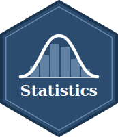
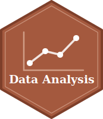

```{=html}
<div class="bib-stats">
  <div class="bib-stat">
    <div class="bib-label">總學分數</div>
    <div class="bib-number" data-target="22" data-decimals="0">0</div>
  </div>
  <div class="bib-stat">
    <div class="bib-label">修課人次</div>
    <div class="bib-number" data-target="488" data-decimals="0">0</div>
  </div>
  <div class="bib-stat">
    <div class="bib-label">教學評量</div>
    <div class="bib-number" data-target="4.6" data-decimals="1">0.0</div>
  </div>
</div>

<script>
document.addEventListener('DOMContentLoaded', function () {
  const counters = document.querySelectorAll('.bib-number');
  const duration = 1000;
  counters.forEach(function (el) {
    const target = parseFloat(el.getAttribute('data-target'));
    const decimals = parseInt(el.getAttribute('data-decimals') || '0', 10);
    const start = performance.now();
    function step(now) {
      const elapsed = now - start;
      const progress = Math.min(elapsed / duration, 1);
      const eased = 1 - Math.pow(1 - progress, 3);
      el.textContent = (eased * target).toFixed(decimals);
      if (progress < 1) requestAnimationFrame(step);
    }
    requestAnimationFrame(step);
  });
});
</script>
```

## 實踐大學

**國際企業英語學位學程**

:::::: paper-entry
::: hex-col
{fig-alt="Statistics course hex logo"}
:::

::: paper-title
**統計學 (1) & (2)**
:::

::: paper-meta
大學部，上學期：113學年、114學年、115學年；下學期：113學年、114學年
:::

::: paper-desc
兩學期的統計學基礎課程，涵蓋敘述統計、機率，以及假設檢定、迴歸與變異數分析等統計推論方法。每週以觀念講授搭配實作練習進行。
:::

::: paper-links
[課程網站](https://yyliou.github.io/stat){.paper-btn}
:::
::::::

:::::: paper-entry
::: hex-col
{fig-alt="Programming for Application course hex logo"}
:::

::: paper-title
**應用程式設計**
:::

::: paper-meta
大學部，下學期：112學年、113學年、114學年
:::

::: paper-desc
以 R 為主的程式設計入門課程，著重將商業與資料問題轉化為可執行的程式，並透過每週課堂實作累積經驗。
:::

::: paper-links
[課程網站](https://yyliou.github.io/pa){.paper-btn}
:::
::::::

:::::: paper-entry
::: hex-col
{fig-alt="Data Analysis course hex logo"}
:::

::: paper-title
**資料分析**
:::

::: paper-meta
大學部，上學期：113學年、114學年、115學年
:::

::: paper-desc
以現代 R 生態系為核心的實務資料分析課程，著重以 `ggplot2` 與圖形文法（grammar of graphics）進行資料視覺化，將分析結果轉化為清楚的視覺敘事。
:::

::: paper-links
[課程網站](https://yyliou.github.io/da){.paper-btn}
:::
::::::

## 國立臺灣大學

**農業經濟學系 — 教學助理**

:::::: paper-entry
::: paper-title
**農業政策與績效評估**
:::

::: paper-meta
112學年下學期、115學年上學期（張宏浩教授）
:::
::::::

:::::: paper-entry
::: paper-title
**農業法規**
:::

::: paper-meta
110學年下學期（陳政位副教授）
:::
::::::

:::::: paper-entry
::: paper-title
**數量方法**
:::

::: paper-meta
108學年下學期（張宏浩教授）
:::
::::::
